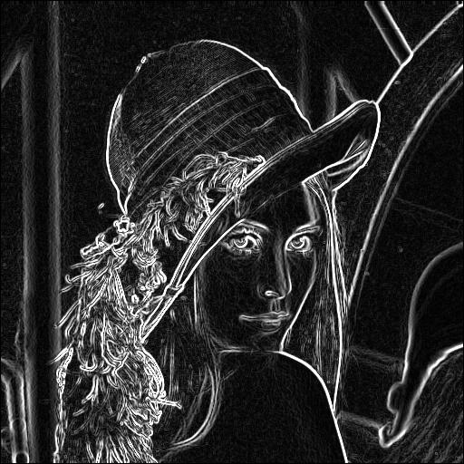

# OpenAI/edgeDetection 
### Date on 7/21/2023

## On Bard 

**Me:** Would you write an image edge detection program in Java?

**Bard:** Sure, here is the Java code for an image edge detection program:  It generated [this code](EdgeDetectorBard.java)

The code generated by Bard has a few issues. So I asked ChatGPT4 to find bugs. The ChatGPT detected bugs very well.

## On ChatGPT
Your code does contain some bugs, or at least things that you might need to reconsider. Here are the issues:

Edge Handling: In your Sobel filter application, you are accessing (x + i, y + j) without checking whether these coordinates are within the image. This could lead to ArrayIndexOutOfBoundsException for the border pixels of the image.

RGB to Intensity: The getRGB function returns a value representing RGB. Using this directly as intensity is incorrect. You need to convert this to grayscale intensity first. You can use the following formula: 0.2989*R + 0.5870*G + 0.1140*B.

Setting RGB values: When setting the RGB values to the output image using setRGB(x, y, magnitude), you are actually setting the RGB value to the magnitude which doesn't correctly represent an image. An RGB value is typically represented in hexadecimal as 0xRRGGBB. So, you need to convert your magnitude value into an RGB format. If you're representing the edges as grayscale (which is typical), you'd use the magnitude for each of the R, G, and B values.

Here is [a corrected version of your code](EdgeDetectorChatGPT.java) 

This is an input and an output image to/from the code generated by the ChatGPT 4 

### Comment
My own expectation on OpenAI was where it will go after 5~10 years later and I already experienced much improvement although I am not 100% sure if this improvement was random experience since I have experienced several random bugs for the last several weeks.

Only about a week, codes from Bard and ChatGPT 4 both had a few bugs such as an ArrayIndexOutOfBoundsException and ChatGPT4 [lied about no bugs](Lie.png).
